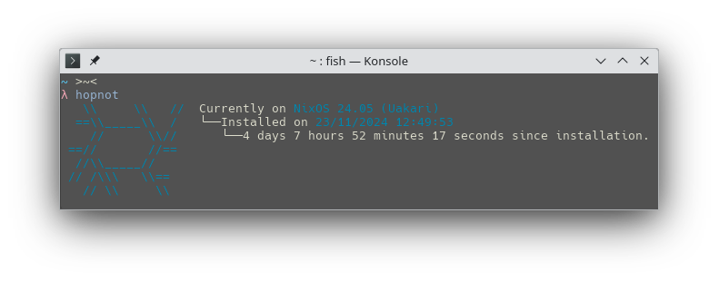

# HopNot

HopNot is a small command line tool to help DistroHoppers by showing how long the OS has been installed for.

# Showcase


# Installation

## Generic Distros

### Pre-requisities
To compile the app you require a few apps; `git`, `dotnet-sdk` and `dotnet-runtime`

```bash
# Ubuntu/Fedora
sudo apt/dnf install git dotnet-sdk-8.0 dotnet-runtime-8.0

# Arch based distributions
sudo pacman -S git dotnet-sdk dotnet-runtime
```

### Compilation
Now, we can start installing the app! <br>
Begin by opening your favourite `terminal emulator`!

Aside the app, we will also need to clone the engine.

```bash
git clone https://github.com/its-Lyn/HopNotCLI
cd HopNotCLI
```

All that is left now is to compile the app. For Linux systems, you can also run `install.sh`, it will move the app to the bin directory. <br>
Run the following command to compile the app.
```bash
dotnet publish -c Release -p:PublishSingleFile=true
```

## NixOS

### Testing
For NixOS, you can test out the app by simply running `nix run github:its-Lyn/HopNotCLI`, this will pull the app to your computer but it won't download anything permanently.

### Permanent Installation
If you want HopNot on your system permanently, you can do the following:

#### Flake enabled systems
In your system's `flake.nix` add the following to your `inputs`:
```nix
inputs = {
	nixpkgs.url = "github:NixOs/nixpkgs/nixos-24.05"

	hopnot = {
		url = "github:its-Lyn/HopNotCLI";
		inputs.nixpkgs.follows = "nixpkgs";
	};
};
```
Now, in your configuration, add this:
```nix
environment.systemPackages = with pkgs; [
	inputs.hopnot.packages."x86_64-linux".hopnot
];
```
Rebuild your system, and done! HopNot is now available for global use.

#### Non-Flake enabled systems
:(

# Credits
DylanAraps and [pfetch](https://github.com/dylanaraps/pfetch) for all the ASCII Art!

[Grimmauld](https://github.com/LordGrimmauld) for the GitHub action creation!

# License
MIT
